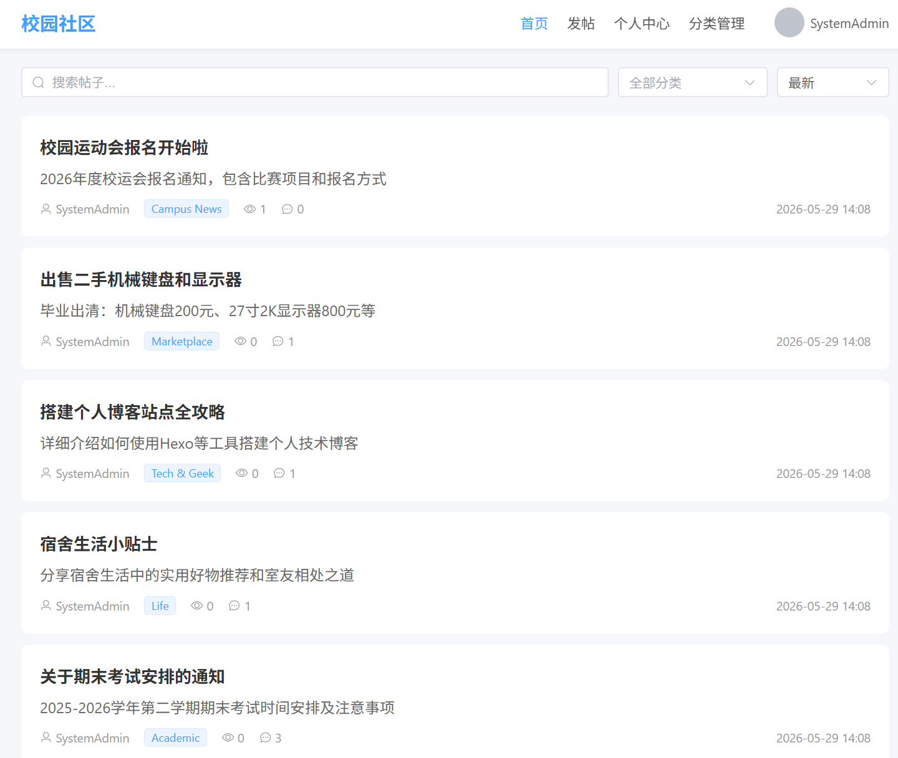
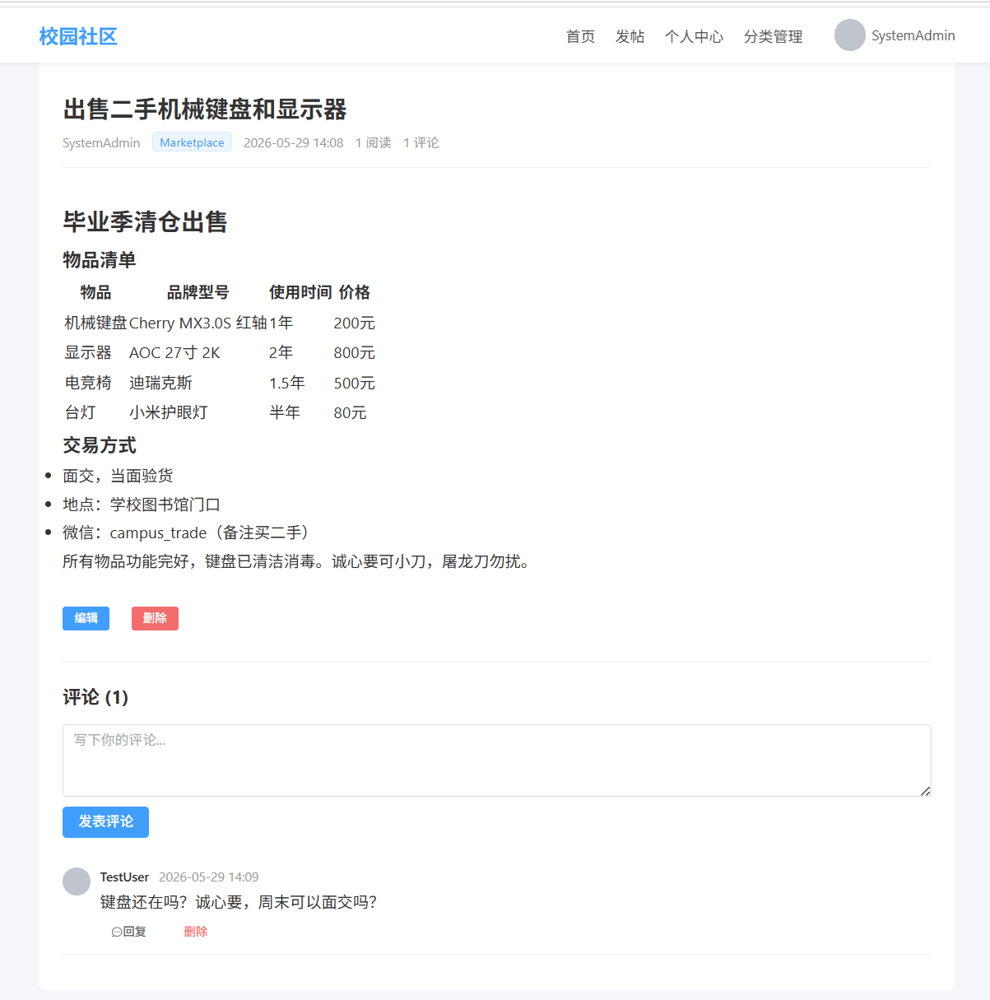
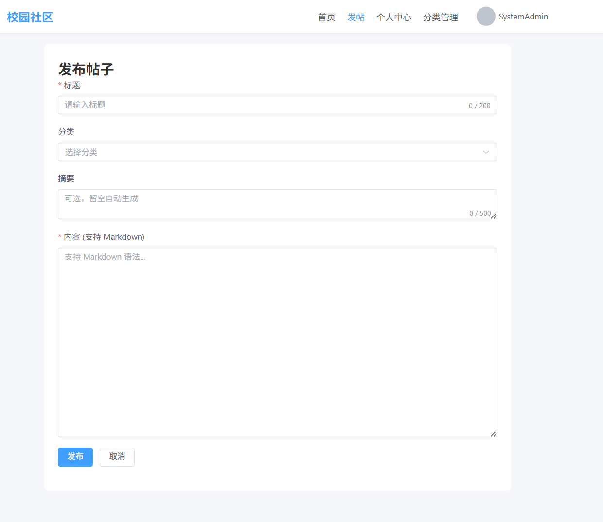
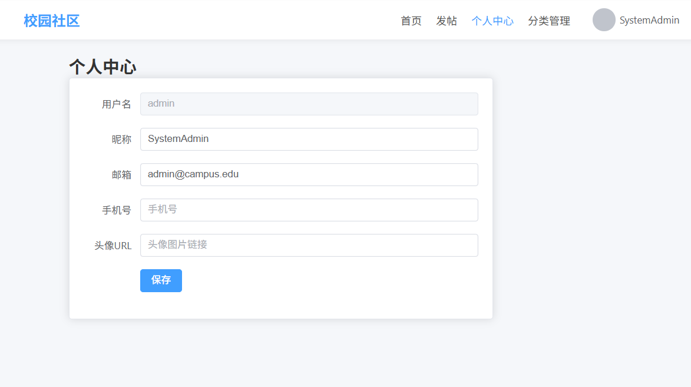
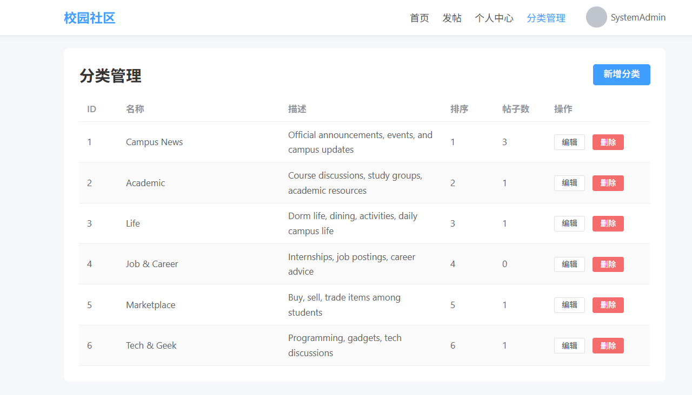

# Campus Community — 校园信息聚合与互动平台

基于 Spring Boot + Vue 3 的校园论坛，支持用户认证、帖子管理、评论互动，并集成 AI 助手实现智能对话与论坛内容检索。

## 技术栈

### 后端
- **Java 17+** + **Spring Boot 3.3.5**
- **MyBatis-Plus 3.5.8** + **MySQL 8.0**
- **Spring Security 6** + **JWT (JJWT 0.12.6)**
- **Redis 7.x**（Token黑名单、刷新令牌、缓存）
- **Knife4j 4.5.0**（API文档）

### 前端
- **Vue 3.5** + **Vite 8.0**
- **Element Plus 2.14**（UI 组件库）
- **Pinia 3.0**（状态管理）
- **Vue Router 4.6**（路由）
- **marked 18.0**（Markdown 渲染）

### AI 助手
- [Campus AI Service](https://github.com/Wuuuuuuuuuz/campus-ai-service) — FastAPI + LangGraph + DeepSeek V4 Flash

## 功能模块

- **用户认证**：注册、登录、JWT双Token机制、Token刷新、注销（黑名单）
- **帖子管理**：CRUD、分类筛选、全文搜索、多维度排序（最新/热门/最热）、置顶、Markdown 编辑
- **评论互动**：评论树形结构、嵌套回复、软删除
- **分类管理**：帖子分类CRUD（管理员）
- **个人中心**：个人信息查看与编辑
- **AI 助手**：悬浮气泡聊天、SSE 流式对话、论坛帖子搜索与总结、语境感知

## 界面预览

| 首页帖子列表 | 帖子详情与评论 |
|:---:|:---:|
|  |  |

| 发布/编辑帖子 | 个人中心 |
|:---:|:---:|
|  |  |

| 分类管理（管理员） |
|:---:|
|  |

## 快速开始

### 环境要求

- JDK 17+
- Node.js 22+
- MySQL 8.0+
- Redis 7.x
- Maven 3.9+
- Python 3.12+（AI 助手服务）

### 安装步骤

1. **克隆仓库**
   ```bash
   git clone https://github.com/Wuuuuuuuuuz/campus-community.git
   cd campus-community
   ```

2. **创建数据库**
   ```bash
   mysql -u root -p < sql/schema.sql
   ```

3. **修改配置**
   编辑 `src/main/resources/application.yml`，修改数据库和 Redis 连接信息。

4. **启动后端**
   ```bash
   mvn spring-boot:run
   ```

5. **启动前端**
   ```bash
   cd frontend && npm install && npm run dev
   ```

6. **启动 AI 助手**（可选）
   详见 [Campus AI Service](https://github.com/Wuuuuuuuuuz/campus-ai-service)

7. **API文档**
   浏览器访问 `http://localhost:8080/doc.html`

### 默认管理员账号

- 用户名：`admin`
- 密码：`admin123`

## 项目结构

### 后端
```
src/main/java/com/campus/community/
├── config/          # Spring配置（Security、MyBatis-Plus、Redis、Knife4j、CORS）
├── security/        # JWT提供器、认证过滤器、认证/授权处理器
├── controller/      # REST控制器（Auth、Post、Comment、Category、User）
├── service/         # 业务逻辑接口
├── service/impl/    # 业务逻辑实现
├── mapper/          # MyBatis-Plus数据访问层
├── entity/          # 数据库实体
├── dto/request/     # 请求体DTO
├── dto/response/    # 响应体DTO（含统一ApiResponse<T>包装）
├── enums/           # 枚举（结果码、角色、帖子状态）
├── exception/       # 自定义异常 + 全局异常处理器
├── util/            # 工具类
└── constant/        # 常量定义
```

### 前端
```
frontend/src/
├── components/      # 可复用组件（NavBar、CommentItem、AiChatFloat）
├── views/           # 页面（Home、Login、PostDetail、PostEditor、Profile、Categories）
├── stores/          # Pinia 状态管理（auth、post、ai）
├── router/          # Vue Router 路由配置
├── utils/           # Axios 实例 + 拦截器
└── styles/          # 全局样式
```

## API 概览

### 认证模块 `/api/auth`
| 方法 | 端点 | 说明 |
|------|------|------|
| POST | /register | 用户注册 |
| POST | /login | 登录获取Token |
| POST | /refresh | 刷新Access Token |
| POST | /logout | 注销（Token加入黑名单） |
| GET | /me | 获取当前用户信息 |

### 帖子模块 `/api/posts`
| 方法 | 端点 | 说明 |
|------|------|------|
| GET | /api/posts | 帖子列表（分页、搜索、分类、排序） |
| POST | /api/posts | 发布帖子 |
| GET | /api/posts/{id} | 帖子详情 |
| PUT | /api/posts/{id} | 编辑帖子（作者/管理员） |
| DELETE | /api/posts/{id} | 删除帖子（作者/管理员，软删除） |

### 评论模块
| 方法 | 端点 | 说明 |
|------|------|------|
| GET | /api/posts/{postId}/comments | 评论列表（树形结构） |
| POST | /api/posts/{postId}/comments | 发表评论/回复 |
| DELETE | /api/comments/{id} | 删除评论（作者/管理员） |

### 分类模块 `/api/categories`
| 方法 | 端点 | 说明 |
|------|------|------|
| GET | /api/categories | 分类列表 |
| POST/PUT/DELETE | /api/categories[/{id}] | 分类CRUD（管理员） |

### 用户模块 `/api/users`
| 方法 | 端点 | 说明 |
|------|------|------|
| GET | /api/users/profile | 查看个人信息 |
| PUT | /api/users/profile | 编辑个人信息 |
| GET | /api/users/{id}/posts | 查看某用户的帖子 |

## 统一响应格式

```json
{
  "code": 200,
  "message": "success",
  "data": { ... }
}
```

## 安全设计

- **Access Token**：JWT，有效期2小时
- **Refresh Token**：UUID 存储于 Redis，有效期7天，刷新时自动轮换
- **注销机制**：Access Token 加入 Redis 黑名单（TTL 与剩余有效期一致）
- **密码加密**：BCrypt
- **角色控制**：USER（普通用户）、ADMIN（管理员）

## AI 助手

项目集成了独立的 AI 助手服务，详见 [Campus AI Service](https://github.com/Wuuuuuuuuuz/campus-ai-service)。

| 功能 | 说明 |
|------|------|
| 智能对话 | SSE 流式输出，多轮会话，历史持久化 |
| 帖子搜索 | AI 可主动搜索论坛帖子 |
| 帖子总结 | AI 可读取帖子全文并进行总结分析 |
| 分类浏览 | AI 可按分类浏览帖子列表 |
| 语境感知 | 帖子详情页对话时自动感知当前帖子内容 |
